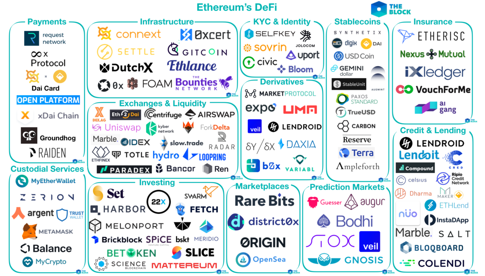
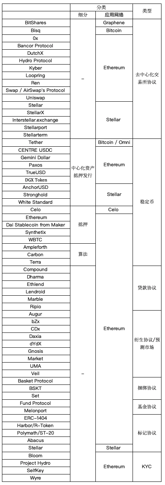

# Awesome Decentralized Finance  

## warning ：

I just translated the original text, translated it into Chinese, and the copyright was owned by the original team.   

我只是对原文进行了翻译，翻译成中文，著作权归原团队所有。 [原始英文链接](https://github.com/ong/awesome-decentralized-finance)

后续添加了很多内容，不在对原文进行跟随，希望成为一个独立的项目。我对Lending Protocols 贷款协议 这一部分，因为个人会用到，对其区块链的借贷模型进行了分析翻译和提交。其他的如果您对这部分感兴趣，欢迎提交pull  requests.

### 精选的去中心金融（DeFi）的相关的项目、软件、资源。

## 什么是去中心化金融?

去中心化金融（#defi）是利用开源软件和去中心化网络将传统金融产品转变为无信任且透明的协议的运动，这些协议在没有不必要的中介的情况下运行。 去中心化金融对金融世界的影响，大家可以回想一下开源软件改变软件产品的影响。
## 所有DeFi的项目

 
 
 --------------
 
 
 
 引用自网络

## 内容

- [Decentralized Exchange Protocols](#decentralized-exchange-protocols) 去中心化的交易所协议
- [Stablecoins](#stablecoins) 稳定币
- [Lending Protocols](#lending-protocols) 贷款协议
- [Derivative Protocols/Prediction Markets](#derivative-protocols) 衍生品协议/预测市场
- [Bundling Protocols](#bundling-protocols)  捆绑协议
- [Tokenization Protocols](#tokenization-protocols) Token化的协议
- [Fund Protocols](#fund-protocols)  基金协议
- [KYC/AML/Identity](#kyc-aml-identity)  了解你的客户/反洗钱/身份 
- [Applications/Tools](#applications-tools)    应用/工具
- [Analytics](#analytics)  分析
- [Misc](#misc) 其他
- [Community](#community)  社区

<a name="decentralized-exchange-protocols" />

## Decentralized Exchange Protocols   去中心化交易所协议

- [BitShares](https://bitshares.org/technology/decentralized-asset-exchange) ([source code](https://github.com/bitshares), [white paper](https://www.bitshares.foundation/download/articles/BitSharesBlockchain.pdf)) - Decentralized exchange protocol based on the Graphene blockchain   基于石墨烯的去中心化的交易所协议
- Bitcoin
  - [Bisq](https://bisq.network) ([source code](https://github.com/bisq-network/bisq), [white paper](https://github.com/bisq-network/bisq-docs/blob/master/exchange/whitepaper.adoc)) - Protocol for peer-to-peer exchange of bitcoin 点对点的比特币交易所协议
- Ethereum
  - [0x](https://0x.org/) ([source code](https://github.com/0xProject), [white paper](https://0x.org/pdfs/0x_white_paper.pdf)) - Protocol for decentralized exchange of Ethereum assets using relayers, now on version 2  基于以太坊资产中继的去中心化交易所协议，现在是第二版
  - [Bancor Protocol](https://about.bancor.network/protocol/) ([source code](https://github.com/bancorprotocol/contracts), [white paper](https://storage.googleapis.com/website-bancor/2018/04/01ba8253-bancor_protocol_whitepaper_en.pdf)) - Protocol for converting one token to another using "smart tokens"    通过”smart tokens“转换一种token到另一种token的协议
  - [DutchX](https://dutchx.readthedocs.io/en/latest/index.html) ([source code](https://github.com/gnosis/dx-contracts), [docs](https://dutchx.readthedocs.io/en/latest/_downloads/DutchX_Documentation.pdf)) - Decentralized trading protocol for ERC-20s that uses the Dutch auction model to achieve fair prices  ERC-20的去中心化交易协议，使用荷兰式拍卖模式实现公平价格
  - [Hydro Protocol](https://hydroprotocol.io/) ([fork announcement](https://medium.com/hydro-protocol/why-we-are-forking-0x-97dc48ee0426), [source code](https://github.com/HydroProtocol), original white paper removed from website but is archived [here](https://whitepaper.io/document/170/hydro-protocol-whitepaper)) - A fork of 0x from DDEX with new order schema, a new matching engine, a different liquidity sharing model, and no ZRX token 来自DDEX的具有新订单模式的0x的分支，新的匹配引擎，不同的流动性共享模型，以及没有使用ZRX令牌
  - [Kyber](https://kyber.network) ([source code](https://github.com/kybernetwork), original white paper removed from website but is archived [here](https://whitepaper.io/document/43/kyber-network-whitepaper)) - On-chain protocol for decentralized token swaps and for easy application integration 用于去中心化的token交换的链式协议，便于应用程序集成
  - [Loopring](https://loopring.org) ([source code](https://github.com/loopring), [white paper](https://loopring.org/resources.html)) - Protocol for building decentralized exchanges  创建去中心化交易所的协议
  - [Ren](https://renproject.io/) ([source code](https://github.com/renproject), [white paper](https://renproject.io/litepaper.pdf)) - Decentralized dark pool protocol for atomic swaps of digital assets formerly known as Republic 用于数字资产原子交换的去中心化”暗池“协议，以前称Republic
  - [Swap / AirSwap's Protocol](https://airswap.io) ([source code](https://github.com/airswap), [white paper](https://swap.tech/whitepaper/)) - Protocol for peer-to-peer trading of ERC-20 tokens ERC-20 Token的对等交易协议
  - [Uniswap](https://uniswap.io) ([source code](https://github.com/Uniswap), [white paper](https://hackmd.io/C-DvwDSfSxuh-Gd4WKE_ig)) - "Public good"-oriented interface for ERC-20 token exchange with zero rent-extraction.  Uniswap是以太坊上自动令牌交换的协议。它围绕易用性，gas效率，审查阻力和零租金提取而设计.

- [Stellar](https://www.stellar.org/developers/guides/concepts/exchange.html) ([source code](https://github.com/stellar), [white paper](https://www.stellar.org/papers/stellar-consensus-protocol.pdf)) - Decentralized protocol for financial applications, including support for decentralized exchange   金融应用的去中心化协议，包括支持去中心化的交易所
  - [StellarX](https://www.stellarx.com/) (closed source) - A UI for the native Stellar DEX built by [Interstellar](https://interstellar.com/)
  - [Interstellar.exchange](https://interstellar.exchange/) (closed source) - A UI for the native Stellar DEX built by [Fintech](https://www.fintech.cm/) (not related to the company Interstellar)
  - [Stellarport](https://stellarport.io) (closed source) - A UI for the Stellar DEX
  - [Stellarterm](https://stellarterm.com/) ([source](https://github.com/stellarterm/stellarterm)) - An open-source UI for the Stellar Dex

<a name="stablecoins" />

## Stablecoins   稳定币

- IOU / Centralized   IOU / 中心化的
  - Bitcoin / Omni
    - [Tether](https://tether.to) (closed source, [white paper](https://tether.to/wp-content/uploads/2016/06/TetherWhitePaper.pdf)) - Controversial USD-backed token connected to Bitfinex 有争议的美元支持的连接到Bitfinex的token
  - Ethereum
    - [CENTRE USDC](https://www.centre.io/usdc) ([source code](https://github.com/centrehq), [white paper](https://www.centre.io/pdfs/centre-whitepaper.pdf)) - ERC-20 stablecoin originally issued by [Circle](https://www.circle.com/en/usdc) and now embraced by [Coinbase](https://blog.coinbase.com/coinbase-and-circle-announce-the-launch-of-usdc-a-digital-dollar-2cd6548d237) ERC-20稳定币最初由Circle发行，现在由Coinbase支持
    - [Gemini Dollar](https://gemini.com/dollar/) ([source code](https://github.com/gemini/dollar), [white paper](https://gemini.com/wp-content/themes/gemini/assets/img/dollar/gemini-dollar-whitepaper.pdf)) - ERC-20 stablecoin issued by Gemini 由”双子座“发行的ERC-20稳定币
    - [Paxos](https://www.paxos.com/standard/) ([source code](https://github.com/paxosglobal/pax-contracts), [white paper](https://standard.paxos.com/whitepaper.pdf)) - ERC-20 stablecoin issued by Paxos Trust Company 由Paxos Trust Company发行的ERC-20稳定币
    - [TrueUSD](https://www.trusttoken.com/trueusd/) ([source code](https://github.com/trusttoken/trueUSD)) - ERC-20 stablecoin with KYC/AML issued by TrustToken 由TrustToken发行的具有KYC / AML的ERC-20稳定币
    - [DGX Token from Digix](https://digix.global/dgx) ([source code](https://github.com/DigixGlobal), [white paper](https://github.com/DigixGlobal/digix-press-kit/blob/master/digix-whitepaper.pdf)) - Token which represents 1 gram of gold on Ethereum  在以太坊上代表1克黄金的代币
  - Stellar
    - [AnchorUSD](https://www.anchorusd.com/) (closed source) - KYC/AML compliant stellar-based token that promises deposits are held 1:1 in audited, US-based bank accounts  基于Stellar Token、 KYC / AML合规的并承诺存款的在经审计的美国银行账户中以1：1持有。
    - [Stronghold](https://stronghold.co/stronghold-usd/) (closed source) - Stellar-based token that provides a KYC/AML compliant USD stablecoin 基于Stellar的Token，提供符合KYC / AML标准的USD stablecoin
    - [White Standard](https://thewhitecompanyus.com/white-standard/) (closed source) - Stellar-based tokens that provide stablecoins for a variety of currencies  基于Stellar的Token，为各种货币提供稳定的币
- Collateralized  基于抵押的
  - [Celo](https://celo.org) (white paper available via Digify by submitting email on [website](https://celo.org)) - Over-collateralized stablecoin targeting the unbanked using its own distributed ledger  过度抵押的稳定币使用自己的分布式账本不锚定银行
  - Ethereum
    - [Dai Stablecoin from Maker](https://makerdao.com/dai) ([source code](https://github.com/makerdao), [white paper](https://makerdao.com/whitepaper/)) - Stablecoin based on smart contracts for creating collateralized debt positions  基于智能合约的稳定币创建抵押债券头寸

    - [Synthetix](https://www.synthetix.io/) ([rebranding announcement](https://blog.havven.io/havven-is-transforming-into-synthetix-2fdf727b8892), [source code](https://github.com/Synthetixio/synthetix), [white paper](https://www.synthetix.io/uploads/synthetix_whitepaper.pdf)) - Decentralized stablecoin modeled on centralized closed loop payment networks formerly known as Havven

      去中心化的稳定币模型以集中式闭环支付网络（以前称为Havven）为蓝本

     - [WBTC](https://www.wbtc.network) ([source code](https://github.com/WrappedBTC/bitcoin-token-smart-contracts), [white paper](https://www.wbtc.network/assets/wrapped-tokens-whitepaper.pdf)) - ERC-20 token backed 1:1 by Bitcoin ERC-20 token 1：1锚定比特币
- Algorithmic  基于算法的
  - Ethereum
    - [Ampleforth](https://www.ampleforth.org/) ([rebranding announcement](https://medium.com/ampleforth/fragments-to-ampleforth-thoughts-behind-the-name-change-e38bf95077b2), [source code](https://github.com/ampleforth), [white paper](https://www.ampleforth.org/paper/)) - Monetary policy-based stablecoin protocol formerly known as Fragments  基于货币政策的稳定币协议，以前称为碎片
    - ~~[Basis](https://www.basis.io) ([white paper](https://www.basis.io/basis_whitepaper_en.pdf)) - Algorithmic stablecoin that "can be robustly pegged to arbitrary assets or baskets of goods"~~ - shut down due to inability to release tokens without securities classification in the US
    - [Carbon](https://fiat.carbon.money) ([white paper](https://www.carbon.money/whitepaper.pdf)) - Stablecoin that will be composed of a basket of whitelisted tokens that is "functionally fiat-backed with the potential to whitelist an algorithmic stablecoin" Stablecoin将由一篮子列入白名单的令牌组成，这些令牌具有“功能性平坦支持，可能将算法稳定币列入白名单”
    - [Terra](https://terra.money) ([white paper](https://s3.ap-northeast-2.amazonaws.com/terra.money.home/static/Terra_White_paper.pdf?fab2019)) - Protocol that ensures price-stability by algorithmically expanding and contracting supply      通过算法扩展和收缩供应来确保价格稳定的协议

<a name="lending-protocols" />

## Lending Protocols  贷款协议

- Ethereum
  - [Compound](https://compound.finance) ([source code](https://github.com/compound-finance/), [white paper](https://compound.finance/documents/Compound.Whitepaper.v04-83de48b6622ddd665234b41076d04c8b.pdf?vsn=d)) - Protocol for algorithmic money markets 基于算法的货币市场协议
  - [Dharma](https://dharma.io) ([source code](https://github.com/dharmaprotocol), [white paper](https://whitepaper.dharma.io)) - Protocol for building lending products using tokenized debt 使用代币化债务建立贷款产品的协议
  - [Ethlend](https://ethlend.io) ([source code](https://github.com/ETHLend), [white paper](https://github.com/ETHLend/Documentation/blob/master/ETHLendWhitePaper.md)) - Marketplace for peer-to-peer lending 点对点借贷市场
  - [Lendroid](https://www.lendroid.com) ([source code](https://github.com/lendroidproject), [white paper](https://uploads-ssl.webflow.com/5b3d0e23faf03c5dc943df64/5b3d0e23faf03c96e243df86_whitepaper-margin-trading-2-18.pdf)) - Protocol for decentralized lending, margin trading, and short selling  去中心化的贷款，保证金交易和卖空协议
  - [Marble](https://marble.org) ([source code](https://github.com/marbleprotocol)) - "Flash lending" protocol for borrowing "Ether and ERC20 tokens to take advantage of arbitrage opportunities on Ethereum"  借助“Ether和ERC20令牌以利用以太坊套利机会”的“Flash借贷”协议 
  - [Ripio](https://ripiocredit.network/) ([source code](https://github.com/ripio/), [white paper](https://ripiocredit.network/wp/RCN%20Whitepaper%20ENG.pdf)) - P2P global credit network protocol based on cosigned smart contracts  基于签约智能合约的P2P全球信用网络协议

<a name="derivative-protocols" />

## Derivative Protocols/Prediction Markets  金融衍生品协议/预测市场

- Ethereum
  - [Augur](https://www.augur.net) ([source code](https://github.com/AugurProject/augur), [white paper](https://www.augur.net/whitepaper.pdf)) - Prediction market protocol to enable anyone to "create and speculate on derivatives at a low cost for the first time"  预测市场协议，使任何人“第一次以低成本创建和推测衍生品”
  - [bZx](https://b0x.network) ([source code](https://github.com/bZxNetwork), [white paper](https://b0x.network/pdfs/b0x_white_paper.pdf)) - 0x-integrated protocol for decentralized, peer-to-peer margin funding and trading  0x-集成协议，用于去中心化的，点对点的保证金融资和交易
   - [CDx](https://cdxproject.com) ([white paper](https://cdxproject.com/assets/resources/cdx-whitepaper.pdf)) - Protocol for tokenized credit default swaps  用于Token化的信用违约互换的协议
   - [Daxia](https://www.daxia.us) ([source code](https://github.com/DecentralizedDerivatives), [white paper](https://github.com/DecentralizedDerivatives/DRCT_standard/blob/master/InDepthOverview.md)) - Tokenized derivatives protocol  Token化的衍生品协议
  - [dYdX](https://dydx.exchange) ([source code](https://github.com/dydxprotocol/protocol), [white paper](https://whitepaper.dydx.exchange/)) - Margin-trading and options protocols  保证金交易和期权协议
  - [Gnosis](https://gnosis.pm) ([source code](https://github.com/gnosis), [white paper](https://gnosis.pm/assets/pdf/gnosis-whitepaper.pdf)) - Decentralized prediction market protocol  去中心化的预测市场协议
  - [Market](https://marketprotocol.io) ([source code](https://github.com/MARKETProtocol), [white paper](https://marketprotocol.io/assets/MARKET_Protocol-Whitepaper.pdf)) - Protocol for structuring peer-to-peer agreements that settle in the future based on the price of a reference asset  构建基于参考资产价格在未来结算的点对点协议
  - [UMA](https://umaproject.org) ([white paper](https://umaproject.org/UMA-whitepaper.pdf)) - Protocol that allows any two counterparties to design and create their own financial contracts that are secured with economic incentives alone, making them self-enforcing and "universally accessible"  允许任何两个交易对手设计和创建自己的金融合同的协议，这些合同仅通过经济激励来保证，使其自我实施并“普遍可获得”
  - [Veil](https://veil.co) ([launch post](https://medium.com/veil-blog/introducing-veil-649036f9d492)) - Peer-to-peer prediction market and derivatives platform built on top of Augur, 0x, and Ethereum  在Augur，0x和以太坊之上构建的点对点预测市场和衍生平台

<a name="bundling-protocols" />

## Bundling Protocols   捆绑协议

- Ethereum
  - [Basket Protocol](https://www.coinalpha.com/projects) ([source code](https://github.com/CoinAlpha/basket-protocol)) - Protocol for creating tokens that contain a portfolio of other tokens

    用于创建包含其他令牌组合的令牌的协议

  - [BSKT](https://cryptofinlabs.github.io) ([source code](https://github.com/cryptofinlabs/bskt), [white paper](https://github.com/cryptofinlabs/bskt-whitepaper/blob/master/bskt-whitepaper-v1.0.0.pdf)) - Generic smart contract that creates decentralized token portfolios  创建分散式令牌组合的通用智能合约

  - [Set](https://www.setprotocol.com/) ([source code](https://github.com/SetProtocol/set-protocol-contracts), [white paper](https://www.setprotocol.com/pdf/set_protocol_whitepaper.pdf)) - Protocol for creating, issuing, redeeming, and rebalancing fungible, collateralized baskets of tokenized assets  创建，发行，赎回和重新平衡可转换，抵押的代币化资产篮子的协议

<a name="fund-protocols" />

## Fund Protocols  基金协议

- Ethereum
  - [Fund Protocol](https://www.coinalpha.com/projects) ([source code](https://github.com/CoinAlpha/fund-protocol)) - Protocol for fund administration on the Ethereum blockchain  以太坊区块链基金管理协议
  - [Melonport](https://melonport.com) ([source code](https://github.com/melonproject), [green paper](https://github.com/melonproject/paper/blob/master/melonprotocol.pdf)) - Protocol for digital asset management   数字资产管理协议

<a name="tokenization-protocols" />

## Tokenization Protocols   Token化 协议 STO相关
- Ethereum
  - [Harbor/R-Token](https://harbor.com) ([source code](https://github.com/harborhq), [white paper](https://harbor.com/rtokenwhitepaper.pdf)) - Compliant protocol for standardizing crypto-securities issuance and trading 用于标准化加密证券发行和交易的兼容协议
  - [Polymath/ST-20](https://polymath.network) ([source code](https://github.com/PolymathNetwork), original white paper removed from website but is archived [here](https://whitepaper.io/document/57/polymath-whitepaper)) - Platform for tokenizing securities  用于标记证券的平台
  - [Abacus](https://abacusfi.com/) ([soure code](https://github.com/abacusfi), [white paper](https://github.com/abacusfi/whitepaper/blob/master/whitepaper.pdf)) - Protocol for permissioned tokens  许可令牌的协议
- [Stellar](https://www.stellar.org/) ([source code](https://github.com/stellar/stellar-core), [docs](https://www.stellar.org/developers/guides/concepts/assets.html)) - Stellar has first-party support for issuing arbitrary tokens  Stellar自身支持发行任意的令牌

<a name="kyc-aml-identity" />

## KYC/AML/Identity     KYC/AML/身份验证
- Ethereum
  - [Bloom](https://bloom.co) ([source code](https://github.com/hellobloom), [white paper](https://bloom.co/whitepaper.pdf)) - Protocol for identity & credit-scoring  身份和信用评分协议
  - [Project Hydro](https://projecthydro.org/) ([source code](https://github.com/HydroBlockchain), [white paper](https://github.com/HydroBlockchain/hydro-docs)) - Decentralized ecosystem using cutting-edge cryptography to secure user accounts, identities, and transactions  使用尖端密码术来保护用户帐户，身份和交易的去中心化的生态系统
  - [SelfKey](https://selfkey.org) ([source code](https://github.com/SelfKeyFoundation/Identity-Wallet), [white paper](https://selfkey.org/selfkey-whitepaper)) - "Self-sovereign" identity management system that aims to integrate with various financial services  旨在与各种金融服务相结合的“自我主权”身份管理系统
  - [Wyre](https://www.sendwyre.com) ([source code](https://github.com/sendwyre), [Medium post](https://blog.sendwyre.com/announcing-the-wyre-sdk-on-ramps-off-ramps-in-under-10-lines-of-code-f2b127eccb5d)) - Compliance SDK that mints ERC-721 tokens to the addresses of verified users       Compliance SDK将ERC-721令牌缩减为已验证用户的地址

<a name="applications-tools" />

## Applications/Tools 应用集/工具集
- Ethereum
  - [AMP](https://amp.credit/) - DeFi Software Developer with [EasyCDP](https://easycdp.com/), [SilverWire](https://silverwire.io/), [MultiSupply](https://multi.supply/), and [StableWire](https://stablewire.com/)

  - [Bloqboard](https://bloqboard.com) - Lending platform for collateralized loans originated, settled, serviced, and managed on Ethereum and powered by Compound and Dharma   抵押贷款的贷款平台由以太坊发起，结算，服务和管理，由Compound和Dharma提供支持

  - [Fetch](https://hellofetch.co) - Application that is both a decentralized exchange aggregator for price discovery and trading and a dashboard for discovering and managing decentralized loans and borrowings 

    应用程序既是用于价格发现和交易的去中心化的交换聚合器，也是用于发现和管理去中心化的贷款和借款的仪表板

  - [InstaDApp](https://instadapp.io) - "Decentralized bank" interface built on top of MakerDAO by developers of [MakerScan](https://makerscan.io)  MakerScan开发人员在MakerDAO之上构建了“去中心化银行”界面

  - [Multis](https://multis.co) ([white paper](https://multis.co/white-paper.html)) - Interface for multisig contracts positioned as "cryptobank for companies"

    定位为"加密银行公司"的多签的合同接口

  - [Settle](https://settle.finance) - Web interface that combines chat with different crypto tools (including portfolio tracking and integration with DeFi protocols) and an "app store" for developers

    将聊天与不同加密工具（包括组合跟踪和与DeFi协议集成）和开发人员的“应用商店”相结合的Web界面

  - [Zerion](https://zerion.io) ([source code](https://github.com/zeriontech)) - Interface to decentralized finance protocols positioned as "trustless banking"

    定位为“无信任银行”的去中心化的融资协议的接口

<a name="analytics" />

## Analytics  分析
- Ethereum
  - [0xTracker](https://0xtracker.com) - 0x protocol trade explorer and decentralised ERC-20 token price index  0x协议交易资源管理器和去中心化的ERC-20令牌价格指数
  - [CuriousGiraffe](https://www.curiousgiraffe.io) - Analytics for [AirSwap](https://www.curiousgiraffe.io/airswap/), [Augur](https://www.curiousgiraffe.io/augur/), [Compound](https://www.curiousgiraffe.io/compound/), and [KyberSwap](https://www.curiousgiraffe.io/kyberswap/)
  - [DEX Terminal](https://dexterminal.com) - Dashboard of decentralized finance activities, from exchange volume to lending/borrowing rates  去中心化的金融活动的仪表板，从交换量到贷款/借款利率
  - [ETH in DeFi](https://mikemcdonald.github.io/eth-defi/) - Chart of the amount of ETH locked in DeFi products (Maker, Compound, Augur, dYdX, Uniswap)  锁定在DeFi产品中的ETH数量图表（Maker，Compound，Augur，dYdX，Uniswap）
  - [Loanscan](https://loanscan.io/) - Explorer for Ethereum loans
  - [MakerScan](https://makerscan.io) - Explorer for MakerDao
  - [MKR Tools](https://mkr.tools/) - Explorer for MakerDao
  - [Uniswap ETH Liquidity](https://mikemcdonald.github.io/uniswap/eth-token-liquidity) - Chart of Uniswap's ETH liquidity by token
- [DeFI Pulse](https://defipulse.com/) - Dashboard with info about locked amount in USD
- [Stablecoin Index](https://stablecoinindex.com/) - Chart of prices biggest stablecoins
- [Stable Report](https://stable.report/) - Weekly reports about stablecoins and list of most stablecoins  关于稳定币和大多数稳定币列表的每周报道

- [tableau相关的DeFi的图表对比](https://public.tableau.com/profile/alethio.defi#!/)
- [Alethio DeFi](https://dexindex.io/)  An open source tool that searches Ethereum decentralized exchanges to find the best token prices.
- [DeFi.dappReview ](https://defi.dapp.review/)  DappReview出关于DeFi的相关网站
- [DappTotal.DeFi](https://dapptotal.com/defi)  DappTotal 出的关于DeFi的数据分析网站，DeFi排行。
- [DeFiPrime](https://defiprime.com/) List of the best Decentralized Finance Products

<a name="misc" />

## Misc  其他
- Ethereum
  - [8x Protocol](https://8xprotocol.com) ([source code](https://github.com/8xprotocol), [white paper](https://rawcdn.githack.com/8xprotocol/whitepaper/master/latest.pdf)) - Protocol for decentralized subscription payment  去中心化的订阅付款协议
  - [AZTEC Protocol](https://www.aztecprotocol.com) ([source code](https://github.com/AztecProtocol/AZTEC), [white paper](https://github.com/AztecProtocol/AZTEC/blob/master/AZTEC.pdf)) - Privacy-enabling protocol for confidential transactions on the Ethereum network  用于以太坊网络上的机密交易的隐私启用协议
  - [Centrifuge](https://www.centrifuge.io) ([source code](https://github.com/centrifuge), [white paper](https://centrifuge.io/centrifuge_os_white_paper.pdf)) - Platform for financial supply chain, including exchange of invoices, purchase orders, etc. 金融供应链平台，包括交换发票，采购订单等。
  - [Groundhog](https://groundhog.network) - "End-to-end" platform for decentralized recurring subscription payments  去中心化的订阅付款的“端到端”平台

<a name="community" />

## Community  社区
* [DeFi Reddit](https://www.reddit.com/r/defi/)
* [DeFi Telegram](https://t.me/de_fi)

<a name="contributions" />

## Contributions  提供你的分享
我们不在跟随原版的英文repo.
如果你想提交PR，欢迎跟我联系，[@liuis](liuisblockchain@gmaill.com)

## License

